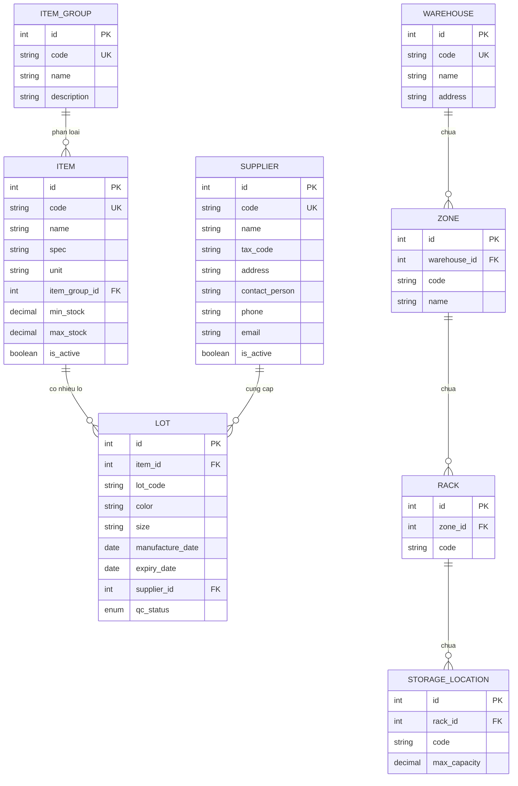

# ERD — Module 1/6: Danh mục & Master Data

## Ghi chú

- Mọi bảng đều có thêm `created_at`, `updated_at`, `created_by`, `updated_by` (nullable, chưa FK), `deleted_at` (soft delete) — không vẽ trong sơ đồ trên để đỡ rối.
- `qc_status` là enum dùng chung với module QC sau này: `PENDING`, `IN_PROGRESS`, `PASSED`, `FAILED`, `PARTIALLY_PASSED`, `PENDING_DISPOSITION`.
- `StorageLocation` hiện chưa có quan hệ trực tiếp với `Lot` trong module này (việc gán lô vào vị trí cụ thể thuộc phạm vi module Nhập/Xuất kho sau này).
- Unique composite: `Zone(warehouse_id, code)`, `Rack(zone_id, code)`, `StorageLocation(rack_id, code)`, `Lot(item_id, lot_code)`.
